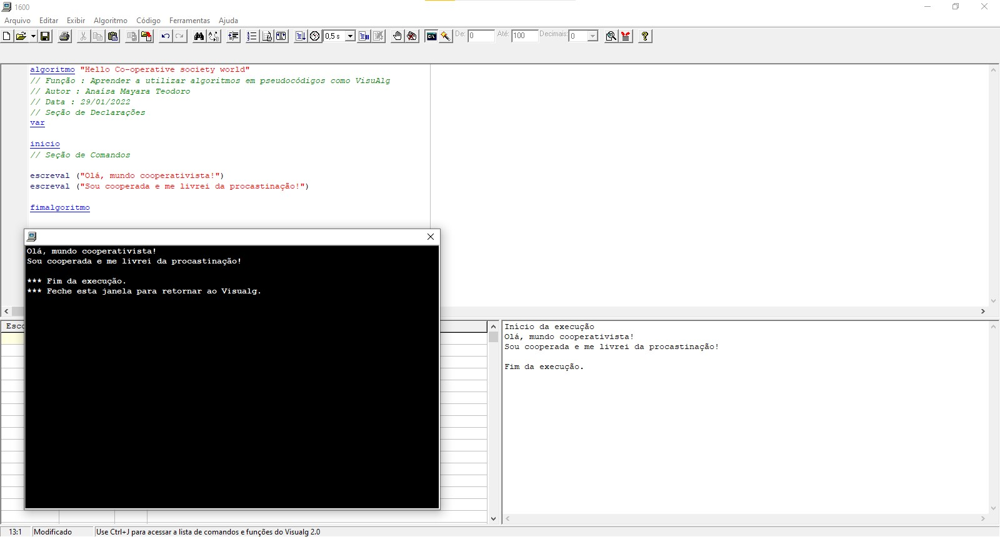

# Progrid- Curso de Introdução à lógica de programação

 PROGRID - PROGRAMA DE INTREGRAÇÃO E DESENVOLVIMENTO DE COOPERADOS E COMUNIDADE 

 * Categoria do Curso: competências profissionais | Iniciação a programação | 2022  
 * Tal curso EaD é oferecido pela VIACREDI em parceria com a escola ProWay da cidade de Blumenau/SC
 * Instrutor: Marcio Michelluzzi

# Hello Co-operative society world! 

 Exemplo de algoritmo no pseudocódigo VisualG 
// Seção de Comandos
escreval ("Olá, mundo cooperativista!")
escreval ("Sou cooperada e me livrei da procastinação!")
fimalgoritmo

# Conteúdos
---

* [Pré-requisitos](#Pré-requisitos)
* [Revisão](#Revisão)
* [Algoritmo](#Algoritmo)
* [Exercícios](####Exercicios) 

# Pré-requisitos
* Estar matriculada no PROGRID;
* Disponibilidade de 20 horas para participar de tal curso;
* Possuir um computador ou mobile para acesso a plataforma;
* Ter disponibilidade de internet;
* Disponibilidade em aprender; 
* Realizar atividade final;
* Terminar o curso;

 # Sobre o curso

Educação, Formação e Informação são atreladas as missões da cooperativa VIACREDI em contribuir para a formação econômica-social e cultural dos cooperados>

 Iniciativas estas, em que o PROGRID realiza tais missões no papel ao qual foi desginado dentro da cooperativa.Assim, todo cooperado, que estude por via deste programa de desenvolvimento, pode optar por cursos presenciais e/ou EaD entre várias trilhas de aprendizados que desejar.  

 O cooperado assim, pode matricular-se nas mais variadas formações, desde a compentências profissionais a Saúde e Bem-Estar. Como, é o caso deste curso que optei em participar. Tal curso é chamado de Introdução à Lógica de Programação - pertencente a plataforma de educação à distância do PROGRID. 

 Neste curso, iniciei os estudos com o preceito de aprendendo a aprender. Ou seja, aprender com objetivo de olhar de "outro jeito", por via de outras experiências e vivências sobre os estudos de algoritmos. Qualificando ainda, que a prática deste cursp é enriquecedora na estruturação de ideias de alguns algoritmos. Por fim, o primeiro passo, foi o de seguir o tal famoso preceito: começar pelo básico.  

Enfim, preparar para a contagem, 1..2..3.. iniciando rumo a Tecnologia e Programação. 🚀

* Vamos assim, começar pelo Algoritmo. 
* Curso voltado a conceitos básico de lógica para a iniciação a programação.
* Depois, indico o usuário a cursar Lógica de Programação I, em que é possível revisar alguns dos conceitos estudados aqui neste curso por intermédio dos exercícios práticos.
---

## Revisão

Essa revisão vai te ajudar a relembrar conceitos e modelos para estabelecer o seu mapa mental de aprendizado! 😃

Lembrando que na introdução a linguagem de programação, precisamos ter em mente:

* O que é Algoritmo?
* O que é Lógica?
* Aprender uma dada linguagem de programação, como início da trajetória de seus estudos.

### Algoritmo

Algoritmo é um procedimento para descrever um passo a passo para solução de um problema. Ou mais detalhadamente aqui nos estudos introdutórios de programação, são passos a serem seguidos por um módulo processador e seus respectivos usuários que, quando executados na ordem correta, conseguem realizar determinada tarefa.

É dado uma sequência detalhada de ações a serem executaddas para realizar alguma tarefa.

Exemplo de simulação de algoritmo do acesso a plataforma de educação à distância do PROGRID:

* Passo 1: Usuário entra no site do PROGRID
* Passo 2: Usuário seleciona no ícone login da plataforma online 
* Passo 3: Usuário escolhe a Cooperativa ao qual pertence
* Passo 4: Usuário digita o CPF no seu login
* Passo 5: Em seguida, o usuário digita a senha do seu login
* Passo 6: Usuário entra na plataforma
* Passo 7: Usuário escolhe em algumas das trilha de aprendizado, um curso que deseja fazer
* Passo 8: Usuário matricula-se em tal curso
* Passo 9: Usuário inicia o seu curso online com sucesso!

A origem da tal palavra e criação do algoritmo se deu pelo matemático iraniano Abu Abdullah Muhammad Ibn Musa al-Khwarizmi.

### O que é lógica?

A lógica como uma investigação intelectual, segundo os dados históricos, foi criada no século IV a.C pelo filósofo grego Aristóteles (384-322 a.C). Seu percurssor, contribuiu para a área de investigação da lógica com a teoria do silogismo - que é um tipo particular de argumento, tendo sempre duas premissas e, claro, uma conclusão. Exemplo:

* Todo cooperado é um mamífero
* Nenhum mamífero é um dinossauro
* Nenhum dinossauro é um leão

O que Aristóteles procurou fazer é caracterizar as formas de silogismos e determinar quais delas são válidas e quais não são.

Asssim, a lógica, enquanto propriedade linguística, não se preocupa com a veracidade dos enunciados, mas com a validade formal lógica, ou seja, com a possibilidade de sentido da frase dada por sua estrutura.
Se a estrutura de uma frase é correta, isto é, se ela segue um padrão formal correto, podemos dizer que a frase é logicamente válida.

* Resumindo:
A lógica consiste na construção racional e coerente do raciocínio.

Já a lógica nos computadores só passou a ser uma área da Matemática a partir dos trabalhos de George Boole (1815-1864) e Augustus de Morgan (1806-1871), quando eles apresentaram os fundamentos da lógica algébrica. Isso possibilitou o aprofundamento na programação, o que, por sua vez, forneceu bases para a criação da informática e dos computadores.

#### Aprender uma dada linguagem de programação.

Para um estudante de programação, criar o algoritmo do software é o primeiro passo, ou seja, primeiro você cria o algoritmo do que você quer que o software faça. Assim, um algoritmo precisa

* Seguir um conjunto de passos.
* Resolver um problema para alcançar um objetivo.
* Ter um passo inicial e um passo final.

Assim, depois que você converte esse algoritmo para uma linguagem que o computador entenda, transforma-se numa linguagem de programação.

O objetivo deste curso, era entender o que são algoritmos e que um programa de computador, por exemplo, especifica um conjuto de instruções que será executado pelo processador em uma determinada sequência. E este programa leva o computador a executar alguma tarefa.

Nota-se assim que um programa nada mais é, que um tipo de algoritmo. Sua particularidade é de que suas operações são específicas para o computador e restritas ao conjunto de instruções  que o processor pode executar. Assim, a linguagem de programação quanto mais semalhança tiver com a linguagem de máquina, mais baixo é o nível de linguagem.

No caso do próximo curso de Lógica de Programação I, atentara-se ao uso de pseudocódigos, que tem um grau de rigidez sintática intermediária entre as linguagens natural e de programação. Além de poder utilizar o idioma nativo para melhor compreensão do algoritmo e a copilação que pode ser traduzido de forma direta a alguma linguagem de programação real. 

#### Exercícios

Os exercícios estão numa pasta aqui do repositório.

####  É  mais uma oportunidade de continuar aprendendo a introdução a linguagem de programação!

Agora, trata-se mais de aprender os pressupostos que desejas no processo de programar, já que há infindável informações, e necessitas selecionar as mais relevantes para o seu uso específico e dado o problema que precisarás resolver. 

Além é claro, de confrontá-las e, usando um método específico, participando assim ativamente da construção da trajetória para a introdução ao mundo da programação.

### Eu sou, a Anaísa 😃 (Propagadora de educação cooperativista e eterna aprendiz!)
- [Twitter](https://twitter.com/AnaisaMayara)
- [Linkedin](https://www.linkedin.com/)
- [Github](https://github.com/anaisateodoro)
- [Email](anaisateodoro@hotmail.com)

